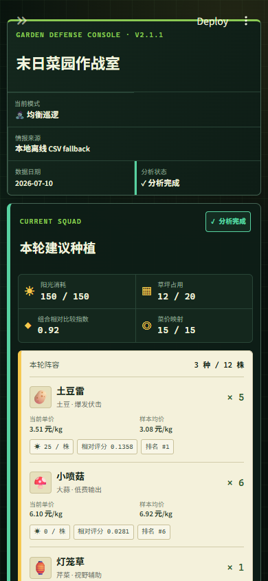

# 🌻 末日菜园作战室：真实菜价 × 植物策略推荐系统

> 僵尸来了先别慌，看看今天土豆多少钱。毕竟末日可以不精致，但种菜不能不讲性价比。😁

PvZ Economy Engine V2.1.1 是一个“看起来在打僵尸，实际上认真做数据分析”的蔬菜种植推荐系统。它把北京示例数据或用户上传的任意地区菜价、植物策略属性和有限资源约束放进同一块草坪里，专门研究一个非常严肃、也非常离谱的问题：**如果末日真的来了，有限的阳光和格子到底该种什么，才能既守住脑子，又守住钱包？**

系统会采集或读取真实菜价，清洗数据，把现实蔬菜映射成植物，再计算末日性价比指数并推荐种植组合。它不能替你把僵尸赶走，但至少能阻止你在预算只有 150 阳光时，冲动消费一排三线射手。

目前项目已经跑通完整链路，数据从菜市场一路走到草坪，中途没有被僵尸吃掉：

```text
北京新发地公开价格 / 本地 CSV fallback / 用户地区 CSV
  -> crawler.py 采集与回退
  -> preprocess.py 日期、菜名、单位清洗
  -> features.py 30 日价格特征
  -> plants.csv 植物与蔬菜映射
  -> scoring.py 末日性价比指数与理由
  -> optimizer.py PuLP 整数规划 / 贪心 fallback
  -> dashboard.py -> Streamlit PvZ 风格看板
```

## 项目亮点

- **断网也能种菜**：仓库自带 1,350 条、15 种蔬菜的 CSV。网站偶尔休假没关系，菜园不会跟着停工。
- **数据来路清楚**：统一输出 `date,name,price,source`，raw 快照和来源元数据都安排明白，不让来历不明的白菜混进队伍。
- **模型会解释人话**：除了排名，还会告诉你战斗价值、价格低估程度和稳定性。推荐土豆雷不是因为它长得老实，而是因为它确实算得过账。
- **预算意识良好**：阳光、格子、单植物集中度、攻击和防御/控制五项约束逐项检查，坚决制止“全种一种然后祈祷”的激进方案。
- **求解器有后路**：优先让 PuLP 当军师；CBC 临时掉线时，贪心 fallback 会顶上，主打一个队伍可以降级，草坪不能停摆。
- **美术素材很克制**：页面只用 emoji 和原创 CSS，不搬运官方素材——律师函的攻击力不在本系统建模范围内。

## 下载后直接运行

不想先研究 Git、虚拟环境和依赖关系？可以前往 [GitHub Releases](https://github.com/mz579/pvz-economy-engine/releases/latest) 下载 `portable.zip`。完整解压后：

- Windows：双击 `start_windows.bat`；
- macOS / Linux：执行 `bash start_unix.sh`；
- 第一次启动会创建 `.venv` 并安装依赖，随后浏览器自动打开页面；慢速网络可能需要 5–15 分钟，窗口会持续显示下载进度。

发布包里的 `README_FIRST.txt` 是极简操作说明。注意一定要先完整解压，别在压缩包里直接运行——植物能破土而出，Python 环境一般不行。

Windows 启动窗口需要在使用期间保持打开，它就是本地网站的“临时发电机”。若启动失败，窗口不会再表演闪退魔术；请查看窗口提示和同目录生成的 `startup.log`。旧版启动脚本若显示乱码或直接退出，请下载最新 Release。

新版启动器会跳过 Streamlit 的邮箱欢迎流程并关闭匿名使用统计，双击后直接进入本地页面。我们只想分析菜价，不打算顺便经营邮箱通讯录。😁

## 网站界面在哪里？

这是一个运行在本机的 Streamlit Web 应用，不是需要作者一直开着服务器的公共网站。启动成功后访问：

**http://localhost:8501**

桌面端（1280×720）：


移动端（390×844）：



网页左侧可以选择僵尸模式、阳光和格子，也可以填写地区名称、上传当地菜价 CSV 或下载模板。默认不上传时使用北京新发地离线示例。首次打开只显示“等待作战配置”；参数填好后点击唯一主按钮 **“🚀 开始分析”** 才会计算。修改参数但没有再次提交时，页面会保留上一轮结果，避免草坪在你拖动滑块时突然自行换阵。

## 从零开始

建议使用 Python 3.10 或更高版本。Windows PowerShell 示例见下方，照着敲就行，不需要先学会种向日葵：

```powershell
python -m venv .venv
.\.venv\Scripts\Activate.ps1
python -m pip install --upgrade pip
python -m pip install -r requirements.txt
python -m src.pipeline --offline
python -m unittest discover -s tests -v
streamlit run app.py
```

macOS/Linux 只需把激活命令替换为 `source .venv/bin/activate`。浏览器默认打开 `http://localhost:8501`。如果页面顺利出现，恭喜，你已经拥有了一块不用浇水、只吃内存的电子草坪。

离线命令行推荐：

```bash
python cli.py --mode "均衡巡逻" --sun 150 --cells 20
```

命令行也可以直接分析地区 CSV：

```bash
python cli.py --csv data/templates/regional_prices_template.csv --region "成都" --sun 150 --cells 20
```

尝试在线更新北京新发地价格：

```bash
python -m src.pipeline --online
python cli.py --online --mode "尸潮来袭" --sun 200 --cells 25
```

在线请求失败、返回空数据或字段结构变化时会自动改用本地 CSV，不需要改配置。终端会明确打印实际数据来源——网站可以摆烂，程序不行。

## 数据采集与清洗

在线适配器只访问[北京新发地公开价格页面](https://www.xinfadi.com.cn/priceDetail.html)对应的数据接口，默认处理近 30 天。离线源位于 `data/fallback/vegetable_prices.csv`。

北京新发地只是默认示例，不是地区限制。页面支持上传任意地区 CSV：系统会统一清洗单位，只分析能够和植物映射表关联的蔬菜，并把缺少菜价的植物列为“本轮未参赛”。这样既能适配不同地区，又不用养一支专门追着全国菜市场网页改版跑的爬虫维修队。

基础字段契约：

| 字段 | 含义 |
|---|---|
| `date` | 日期，输出为 `YYYY-MM-DD` |
| `name` | 标准蔬菜名，别名会在清洗层统一 |
| `price` | 价格，统一为人民币元/kg；元/斤自动乘 2 |
| `source` | `xinfadi_official`、`local_csv_fallback` 或 `user_upload:地区名` |

上传模板使用 `date,name,price,unit`；也支持 `日期,品种,均价,单位` 等中文表头，以及 UTF-8、GB18030、元/kg 和元/斤。地区名称由侧栏填写，运行时记录为 `user_upload:地区名`。

三种数据模式会在页面同时显示来源、日期和模式，不会把离线样本伪装成实时行情：

| 模式 | 何时使用 | 页面标识 |
|---|---|---|
| 在线数据 | 显式执行在线流水线且新发地接口返回有效数据 | `北京新发地公开价格` / `在线数据` |
| 用户 CSV | 在侧栏上传任意地区菜价并提交分析 | `用户上传 · 地区名` / `用户 CSV` |
| 离线 fallback | 页面默认运行、网络失败或在线字段不可用 | `本地离线 CSV fallback` / `离线 fallback` |

页面展示的价格单位读取自当前清洗结果。V2.1.1 标准输出为 `元/kg`：原始 `元/斤` 会乘以 2，原始 `元/kg` 保持不变；缺少映射菜价的植物显示“未映射菜价”，不会偷偷补一个 0 元白菜价。

`src/features.py` 按蔬菜和日期计算 7/14/30 日均价、30 日历史均价、涨跌幅、价格分位和波动率。`data/raw/` 与 `data/processed/` 中的运行产物已由 `.gitignore` 排除，确保它们只能由流水线生成。

## 植物映射

`data/plants.csv` 包含 15 种植物。核心字段为植物名、映射蔬菜、阳光成本、攻击、防御、产能、控制、特殊能力和定位；`special_tag` 与 `category` 分别用于特殊能力量化和优化器角色识别。

映射规则：

1. 优先使用直接同名作物，例如豌豆射手映射豌豆、土豆雷映射土豆、樱桃炸弹映射樱桃。
2. 无直接对应时按外形或策略用途选择代理蔬菜，例如向日葵映射产能型油菜，坚果墙映射耐储存的大白菜。
3. 映射只连接清洗后的标准菜名，不在评分时做模糊匹配。
4. 多种植物可以共享一种蔬菜价格，但 15 种植物必须全部可关联。

属性值是本项目用于比较的内部策略参数，不宣称等同于官方游戏数值。请不要拿这张表和僵尸进行线下辩论，它大概率不会听。

## 末日性价比指数

### 1. 战斗价值

攻击原始值先按当前映射表最大攻击归一到 0-10；防御、产能、控制本身是 0-10。特殊能力根据 `special_tag` 映射到 0-10：`SINGLE=4`、`SPLASH=7`、`SIGHT=7`、`SLOW=8`、`WALL=8`、`MULTI=8`、`BOMB=9`、`PRODUCE=9`、`AOE=10`。

基础权重为：攻击 35%、防御 25%、产能 20%、控制 15%、特殊能力 5%。

```text
战斗价值 = 攻击分×0.35 + 防御×0.25 + 产能×0.20 + 控制×0.15 + 特殊能力×0.05
```

“尸潮来袭”“铁桶强攻”“迷雾夜战”会对这五项基础权重应用场景倍率，再归一化为 100%；最终场景权重可在“模型说明与技术细节 → 评分与权重”中查看。“均衡巡逻”使用基础权重。

### 2. 市场系数

```text
历史均价 = 最近 30 条日度价格的滚动均值
价格波动率 = 最近 30 条价格的总体标准差 / 历史均价
价格低估系数 = 历史均价 / 当前价格
稳定性系数 = 1 / (1 + 价格波动率)
```

### 3. 最终指数

```text
有效阳光成本 = max(真实阳光成本, 25)
末日性价比指数 = 战斗价值 × 价格低估系数 × 稳定性系数 / 有效阳光成本
```

25 点保护值只用于避免零阳光植物除零和无限放大——否则小喷菇会凭借“不要钱”在数学世界里直接封神。组合优化仍使用 `plants.csv` 中的真实阳光成本。指数保留公式原始尺度，不额外乘 100。每一行排名都会生成由优势维度、价格位置、稳定性和有效成本组成的中文理由。

## 组合优化

这一部分请 PuLP 来当草坪军师：目标是最大化所选植物的末日性价比指数总和，决策变量是每种植物的非负整数数量。军师虽然不打僵尸，但很擅长阻止你超预算。约束为：

1. 总阳光不超过可用阳光；
2. 植物数量不超过格子数；
3. 每种植物最多占草坪容量的 30%，单植物数量上限为 `max(1, ceil(格子数 × 30%))`；
4. 至少包含 1 个攻击植物；
5. 至少包含 1 个防御或控制植物。

30% 是 V2 为降低单一植物集中风险而采用的可解释模型假设，不是现实验证出的最佳比例。该规则统一适用于零成本、低成本和普通植物，不会按植物名称特殊处理。输出包括组合、数量、单株/小计评分、总阳光、总植物数、未使用格数、总评分、求解方式、五项约束检查和推荐摘要。

默认 150 阳光、20 格时，单植物上限为 6 株；当前离线数据在 PuLP 下推荐 `土豆雷 ×5 + 小喷菇 ×6 + 灯笼草 ×1`，使用 150 阳光、占用 12/20 格，组合相对比较指数为 0.9186。剩余 8 格会真实保留为空位：这表示剩余阳光不足，或候选植物已达到单植物数量上限，并不代表求解失败。系统不会为了把草坪塞满而偷偷多种几株蘑菇。greedy fallback 也执行同一数量上限。

## Streamlit 页面

页面信息顺序固定为：本轮结论 → 推荐原因 → 市场证据 → 全部候选植物对比 → 模型与技术细节。上半页先回答“种什么、种多少”，下半页再摆证据，不要求用户先读完一篇论文才能找到土豆。

操作流程：

1. 在侧栏选择僵尸模式、可用阳光和草坪格子；
2. 可选填写地区名称并上传 CSV，不上传则使用离线示例；
3. 点击“🚀 开始分析”；
4. 查看推荐植物、数量、当前单价、样本均价、阳光成本和单株相对评分；
5. 在“市场证据”查看价格趋势及当前价/样本均价对比；
6. 在候选表检查未入选植物，必要时展开“模型说明与技术细节”。

核心结果字段：

| 字段 | 含义 |
|---|---|
| 阳光消耗 | 推荐组合真实阳光成本之和 / 本轮预算 |
| 草坪占用 | 推荐株数 / 可用格子数 |
| 组合相对比较指数 | 入选植物单株相对指数按数量累加，只用于本轮横向比较 |
| 当前单价 / 样本均价 | 当前数据中的最新价与特征窗口均价，均显示真实清洗单位 |
| 单株相对评分 | 当前模式权重和市场数据下的比较值，不是成功概率 |
| 评分排名 | 当前成功映射候选中的单株相对评分名次 |

“模型说明与技术细节”默认折叠，内部按标签页提供评分公式与权重、完整植物排名、优化约束与数据映射、必要调试状态。草坪格子属于**阵容展示布局**，只核对数量和容量，不是优化器输出的最优坐标；优化结果允许保留空格，空格不会被判定为错误或不可行。

截图存放在 `docs/screenshots/dashboard.png` 和 `docs/screenshots/dashboard-mobile.png`，详细采集说明见 `docs/screenshots/README.md`。

## 模型局限性

- 末日性价比指数不是百分制、收益率或成功概率，也不承诺现实种植收益；它只比较当前候选植物。
- 植物属性是项目内部的 0–10 策略参数（原始攻击会归一化），不等同于官方游戏数据。
- V2.1.1 使用固定 30% 草坪占比作为单植物集中度上限；该比例是可解释建模假设，不是现实试验得出的最佳值，也不等同于强制阵容多样性。
- V2.1.1 优化器仍不包含轮作、土地质量、生长周期和重复种植边际收益递减。
- 用户 CSV 只影响成功映射的植物；未映射植物保留作战属性展示，但不参与本轮价格评分和优化。
- 在线数据可能因网站结构或网络失败切换到离线 fallback；页面会显示实际使用的数据来源和日期。
- 草坪位置是展示布局，不是优化器计算出的最优坐标。

## 项目结构

```text
app.py                         # Streamlit 主入口
cli.py                         # 完整链路命令行入口
assets/style.css               # 原创 PvZ 风格主题
data/fallback/                 # 可提交、可复现的离线数据
data/raw/                      # 运行时原始快照与来源元数据
data/processed/                # 运行时清洗和特征文件
data/plants.csv                # 15 种植物映射与属性
src/crawler.py                 # 新发地采集和本地回退
src/preprocess.py              # 字段、别名、日期和单位清洗
src/features.py                # 价格特征
src/plant_mapping.py           # 映射校验与关联
src/scoring.py                 # 正式评分与解释
src/optimizer.py               # PuLP 与贪心优化
src/dashboard.py               # UI 使用的完整视图模型
tests/                         # 单元、UI 与端到端测试
```

## 验证与故障排查

```bash
python -m unittest discover -s tests -v
python -m src.pipeline --offline
python cli.py --mode "均衡巡逻" --sun 150 --cells 20
```

- `python` 找不到：使用已安装解释器的完整路径，或重新打开已激活虚拟环境的终端。
- 新发地连接失败：属于预期可恢复状态，检查终端是否显示 `local_csv_fallback`；这不是投降，是战术性读取本地文件。
- PuLP/CBC 不可用：结果中的 `method` 会显示 `greedy`，四项约束仍会被验证；军师请假，副官照常上班。
- 资源不可行：当阳光或格子不足以同时放入攻击与防御/控制植物时，页面会返回明确错误而不是伪造组合。
- 浏览器控制台偶尔出现 Vega `Infinite extent` 或 scale binding 警告：这是 Streamlit 原生图表在初始化交互范围时短暂使用空选择域导致的渲染周期提示。页面已在绘图前拦截空数据、单条数据和恒定序列；实际图表、数值和推荐不受影响，因此 V2.1.1 不为隐藏控制台提示而更换图表系统或增加依赖。

## V2.1.1 边界与声明

本版本不包含 Airflow、多地区 SaaS、复杂金融 Alpha、夏普比率、金融化回测或重型预测模型。项目是数据分析与运筹优化练习，不隶属于植物大战僵尸版权方，也不包含官方图片、音效或其他游戏素材。
